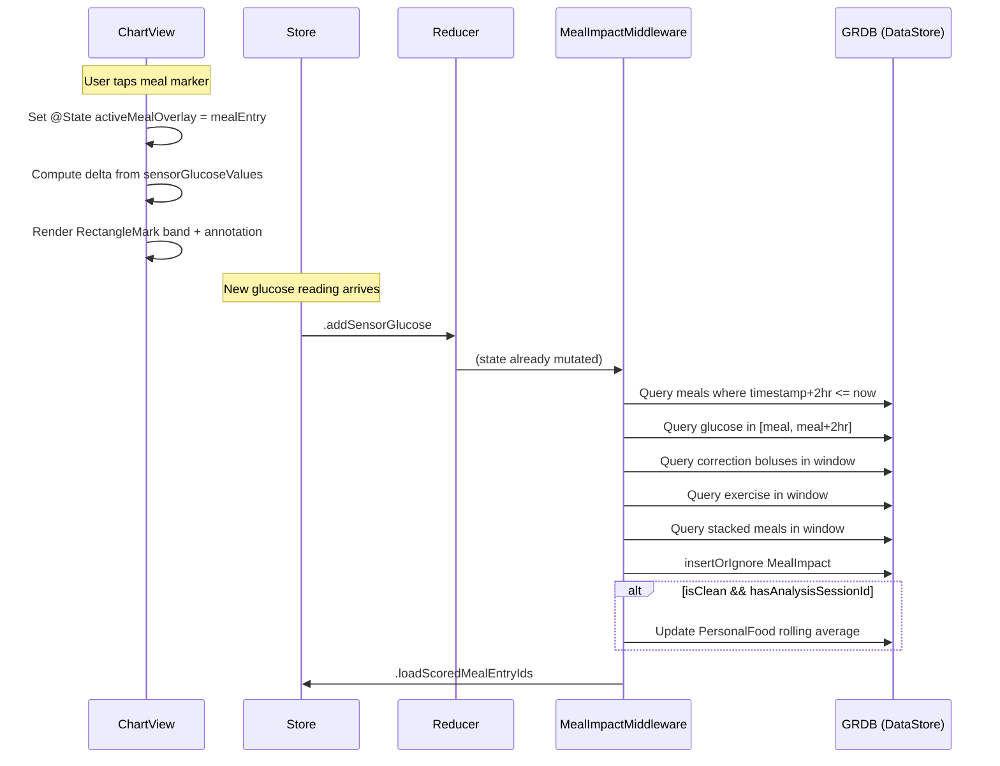

# feat: Meal Impact Overlay with Personal Glycemic Response Tracking

## Overview

Add a tap-to-reveal overlay on chart meal markers that shows the 2-hour post-meal glucose response as a color-coded delta, with confounder detection, per-meal impact persistence, and PersonalFood glycemic scoring for AI-analyzed meals.

## Problem Frame

DOSBTS logs meals and displays glucose data but provides no connection between the two. The meal marker sits at the bottom of the chart while the glucose line floats above. Users cannot learn which foods spike them, and AI food analysis cannot be validated against actual glycemic response. (see origin: `docs/brainstorms/2026-04-18-meal-impact-overlay-requirements.md`)

## Requirements Trace

- R1–R8: Tap-to-reveal overlay on meal markers (replaces tap-to-edit, edit button in overlay, iOS 16+ only)
- R9–R11: Confounder detection (correction bolus, exercise, stacked meal) with dimmed delta
- R12–R15: MealImpact GRDB table with dual-trigger middleware and cascade delete
- R16–R19: PersonalFood glycemic scoring via analysisSessionId linkage
- R20–R22: Chart integration (Z-order, scored marker distinction, zoom/scroll)

## Scope Boundaries

- No meal suggestions or dose recommendations
- No insulin-adjustment math for confounders (flag only)
- No time-to-peak or return-to-baseline display (stored for future use)
- No meal impact data export
- No scoring of multi-food entries beyond the logged combination
- iOS 15 unaffected (ChartViewCompatibility has no meal markers)

### Deferred to Separate Tasks

- Q1: PersonalFood average in Claude food analysis prompt (separate feature)
- Q2: Dedicated "Meal Insights" list view (evaluate after V1 chart overlay ships)

## Context & Research

### Relevant Code and Patterns

- **GRDB table + migration:** `MealStore.swift` — `createMealEntryTable()` with `db.create(ifNotExists:)` then `DatabaseMigrator` for schema evolution. Same pattern in `SensorGlucoseStore.swift`
- **DataStore registration:** `DataStore.swift` — `FetchableRecord`/`PersistableRecord` extension + `Columns` enum for each model
- **Middleware lifecycle:** Handle `.startup` (create table), `.setAppState(.active)` (trigger load), `.loadX` (guard active, async read, emit `.setX`). All stores follow this pattern
- **Cross-middleware chaining:** `FoodCorrectionStore.swift` — handles `.saveMealWithCorrections`, writes DB, emits `.addMealEntry` which chains to `mealEntryStoreMiddleware`
- **Chart tap handling:** `ChartView.swift:902–970` — `DragGesture(minimumDistance: 0)` in `.chartOverlay`, distinguishes taps from drags, nearest-meal lookup with 20-min threshold
- **Chart overlays:** IOB `AreaMark` (lines 636–668), exercise `RectangleMark` (lines 701–709), heart rate `LineMark` (lines 711–722)
- **Meal markers:** `ForEach(mealGroups)` at lines 670–699, diamonds (single) / circles (groups) at `chartMinimum * 0.85`
- **Sheet pattern:** `OverviewView` uses `ActiveSheet` enum with single `.sheet(item:)` to prevent iOS 15 sibling sheet collisions

### Institutional Learnings

- **Dangling Future on nil dbQueue** (`docs/solutions/logic-errors/grdb-future-nil-dbqueue-hangs-subscriber-20260318.md`): Every `Future` closure must call `promise(...)` on all paths including the `dbQueue == nil` guard. Add `else { promise(.success([])) }` to every guard
- **AppState .inactive blocks loads** (`docs/solutions/logic-errors/appstate-inactive-blocks-data-loading-20260317.md`): Must handle both `.setAppState(.active)` to trigger load AND guard `.active` in the load handler
- **Reducer runs BEFORE middlewares** (`docs/solutions/logic-errors/middleware-race-condition-guard-blocks-api-call-Claude-20260313.md`): Never guard on state that the reducer just changed for the same action
- **Nested sheets unreliable** (`docs/solutions/ui-bugs/swiftui-nested-sheets-present-wrong-view-20260316.md`): The overlay must be an inline chart overlay, not a sheet. Edit button routes through existing `ActiveSheet` enum
- **UUID ownership must be single-site** (`docs/solutions/logic-errors/redux-undo-uuid-mismatch-middleware-creates-object-20260315.md`): `analysisSessionId` must be created once in the view and flow through all records — never regenerated by middleware

## Key Technical Decisions

- **Overlay is inline chart content, not a sheet:** The tap-to-reveal overlay renders as SwiftUI Charts marks (`RectangleMark` band + chart annotation) driven by `@State` in ChartView. The edit button within the overlay dispatches to the existing `ActiveSheet` enum for modal presentation. This avoids nested sheet bugs and sibling sheet collisions (see learnings)
- **Dual-trigger middleware:** MealImpact computation fires on both `.setAppState(.active)` (retroactive scan on launch) and `.addSensorGlucose` (real-time as readings arrive). Both paths query GRDB directly for glucose data in the meal's 2hr window — not from in-memory `sensorGlucoseValues` (which only covers last 24 hours)
- **Direct GRDB query for historical glucose:** Add a `getSensorGlucoseValues(from:to:)` method to `SensorGlucoseStore` for parameterized time-range queries. The existing `getSensorGlucoseValues()` is hardcoded to last 24 hours
- **analysisSessionId as linkage key:** A shared `UUID` created once in `FoodPhotoAnalysisView.saveAnalysis()`, set on both the `MealEntry` and each `PersonalFood` entry in the same `.saveMealWithCorrections` dispatch. Middleware extracts it from the action payload — never regenerates it
- **Confounder check queries GRDB directly:** The background computation path queries `InsulinDeliveryStore` and `ExerciseStore` for the meal's 2hr window rather than relying on in-memory state arrays (which may not cover the meal's date)
- **Grouped meal markers show group detail first:** When a grouped meal marker (count > 1) is tapped, the existing group detail sheet opens. Individual entries within the group can then show their impact overlay when tapped from the detail list. This preserves the existing group UX
- **mmol/L conversion:** Store `deltaMgDL` always in mg/dL (matches `SensorGlucose.glucoseValue`). Display converts via existing `glucoseUnit` + `convertToRequired()` pattern. Color thresholds convert correspondingly (30 mg/dL ≈ 1.7 mmol/L, 60 mg/dL ≈ 3.3 mmol/L)

## Open Questions

### Resolved During Planning

- **How does overlay dismiss during scroll?** The overlay is rendered as chart marks in data coordinates (not a floating view), so it scrolls naturally with the chart. Dismiss only on explicit tap outside or tap another element — not on scroll
- **Where does IN PROGRESS state live?** In `@State` within ChartView, computed at render time from `sensorGlucoseValues` and `Date.now`. Transitions automatically when glucose updates arrive via `.addSensorGlucose`
- **How does cascade delete work architecturally?** `mealImpactStoreMiddleware` listens for `.deleteMealEntry` (cross-middleware listening). On receipt, deletes the MealImpact row by `mealEntryId` and emits `.loadScoredMealEntryIds`. Meal edits use delete+re-add (no `.updateMealEntry` exists), so the delete handler covers edit cascade. PersonalFood rolling average is NOT retroactively corrected (accept minor drift)

### Deferred to Implementation

- Exact annotation positioning strategy within the 2hr band (Charts `.annotation(position:)` vs custom ZStack — determine empirically during chart rendering work)
- Confounder icon layout within the overlay (depends on final band dimensions)
- Whether `analysisSessionId` should be indexed in MealEntry (monitor query performance first)

## High-Level Technical Design

> *This illustrates the intended approach and is directional guidance for review, not implementation specification. The implementing agent should treat it as context, not code to reproduce.*

## Implementation Units

- [ ] **Unit 1: MealImpact data model and GRDB table**

**Goal:** Create the `MealImpact` Swift struct, GRDB table, and DataStore registration.

**Requirements:** R12, R15

**Dependencies:** None

**Files:**
- Create: `Library/Content/MealImpact.swift`
- Modify: `App/Modules/DataStore/DataStore.swift` (add Columns enum + FetchableRecord extension)
- Test: `DOSBTSTests/MealImpactTests.swift` (model tests in later unit)

**Approach:**
- `MealImpact` struct: `id: UUID`, `mealEntryId: UUID`, `baselineGlucose: Int`, `peakGlucose: Int`, `deltaMgDL: Int`, `timeToPeakMinutes: Int`, `isClean: Bool`, `timestamp: Date`
- Conform to `Codable`, `Identifiable`, `FetchableRecord`, `PersistableRecord`
- `UNIQUE` constraint on `mealEntryId` column in DDL
- Table creation follows `MealStore.createMealEntryTable()` pattern: `db.create(table:ifNotExists:)` in a synchronous write block

**Patterns to follow:**
- `Library/Content/MealEntry.swift` — struct shape
- `App/Modules/DataStore/DataStore.swift` lines 56–182 — Columns enum pattern

**Test expectation:** none — pure data model scaffolding, tested via middleware in Unit 3

**Verification:**
- `MealImpact.swift` compiles with all required fields
- DataStore.swift has Columns enum and FetchableRecord/PersistableRecord extension

---

- [ ] **Unit 2: analysisSessionId linkage on MealEntry and PersonalFood**

**Goal:** Add `analysisSessionId: UUID?` to both `MealEntry` and `PersonalFood` with GRDB migrations, and wire it through the save flow.

**Requirements:** R17

**Dependencies:** None (parallel with Unit 1)

**Files:**
- Modify: `Library/Content/MealEntry.swift` (add field)
- Modify: `Library/Content/PersonalFood.swift` (add field)
- Modify: `App/Modules/DataStore/DataStore.swift` (add Columns entries)
- Modify: `App/Modules/DataStore/MealStore.swift` (add migration)
- Modify: `App/Modules/DataStore/FoodCorrectionStore.swift` (add migration + pass sessionId through save flow)
- Modify: `App/Views/AddViews/FoodPhotoAnalysisView.swift` (generate sessionId in `saveAnalysis()`)
- Modify: `Library/DirectAction.swift` (no change needed — sessionId flows through existing `MealEntry` in `.saveMealWithCorrections`)

**Approach:**
- Generate `analysisSessionId = UUID()` once in `FoodPhotoAnalysisView.saveAnalysis()` — single ownership site per learning
- Add `analysisSessionId: UUID?` parameter to both `MealEntry` initializers (with default `nil`). MealEntry uses `let` properties so post-init assignment is not possible — the field must be in the init signature
- Pass to `FoodCorrectionStore` via the existing `meal` payload in `.saveMealWithCorrections`
- `FoodCorrectionStore` extracts `meal.analysisSessionId` and sets it on each `PersonalFood` upsert in the same transaction
- Add `DatabaseMigrator` migration in both `createMealEntryTable()` and `createPersonalFoodTable()` to ALTER TABLE ADD COLUMN
- `analysisSessionId` is `nil` for manual meal entries and pre-migration rows

**Patterns to follow:**
- `MealStore.swift` migration pattern (DatabaseMigrator after table create)
- UUID single-ownership pattern from `docs/solutions/logic-errors/redux-undo-uuid-mismatch-middleware-creates-object-20260315.md`

**Test scenarios:**
- Happy path: AI-analyzed meal saves with non-nil analysisSessionId on both MealEntry and matching PersonalFood entries
- Edge case: Manual meal entry has nil analysisSessionId
- Edge case: Pre-migration MealEntry rows have nil analysisSessionId (no crash on read)

**Verification:**
- Existing AI food analysis flow still works end-to-end
- analysisSessionId persists across app restart

---

- [ ] **Unit 3: MealImpact middleware — computation and persistence**

**Goal:** Create `mealImpactStoreMiddleware` that computes and stores MealImpact records when 2hr windows complete, with confounder detection.

**Requirements:** R9, R12, R13, R14, R15

**Dependencies:** Unit 1 (MealImpact model)

**Files:**
- Create: `App/Modules/MealImpact/MealImpactStore.swift`
- Modify: `App/Modules/DataStore/SensorGlucoseStore.swift` (add `getSensorGlucoseValues(from:to:)` query method)
- Modify: `Library/DirectAction.swift` (add `loadScoredMealEntryIds`, `setScoredMealEntryIds`, `deleteMealImpact`)
- Modify: `App/Modules/DataStore/InsulinDeliveryStore.swift` (add `getInsulinDeliveries(from:to:)` time-range query)
- Modify: `App/Modules/DataStore/ExerciseEntryStore.swift` (add `getExerciseEntries(from:to:)` time-range query)
- Modify: `Library/DirectState.swift` (add `scoredMealEntryIds: Set<UUID>`)
- Modify: `App/AppState.swift` (add `scoredMealEntryIds` with default `= Set()`)
- Modify: `Library/DirectReducer.swift` (add reducer cases)
- Modify: `App/App.swift` (add to BOTH middleware arrays)
- Modify: `App/Modules/Log/Log.swift` (suppress new actions from logs)

**Approach:**
- Middleware handles:
  - `.startup` → `createMealImpactTable()`
  - `.setAppState(.active)` → scan for all pending meals (retroactive), emit `.loadScoredMealEntryIds`
  - `.addSensorGlucose` → incremental check for newly-completable meals
  - `.deleteMealEntry` → cascade delete MealImpact by `mealEntryId`, emit `.loadScoredMealEntryIds`. Note: meal edits use delete+re-add (no `.updateMealEntry` action exists), so the delete handler covers both deletion and edit cascade
  - `.loadScoredMealEntryIds` → async read all MealImpact mealEntryIds, emit `.setScoredMealEntryIds`
- Computation path for each pending meal:
  1. Query `SensorGlucoseStore.getSensorGlucoseValues(from: mealTimestamp, to: mealTimestamp + 2hr)`
  2. If < 4 readings, skip (R13 threshold)
  3. Find baseline: closest reading before meal timestamp within 15 min (R4)
  4. Find peak: max glucose in window
  5. Compute delta = peak - baseline
  6. Check confounders: query InsulinDelivery for correction boluses, ExerciseEntry for overlaps, MealEntry for stacks
  7. `insertOrIgnore` MealImpact record
  8. If clean + has analysisSessionId → update PersonalFood rolling average, then emit `.loadPersonalFoods` to refresh in-memory state
- Every `Future` closure must call `promise(...)` on all paths (dangling Future learning)
- Add cross-middleware comments in both this file and `SensorConnector.swift` (both handle `.addSensorGlucose`)

**Patterns to follow:**
- `App/Modules/IOB/IOBMiddleware.swift` — simplest middleware structure
- `App/Modules/DataStore/FoodCorrectionStore.swift` — cross-middleware chaining pattern
- `App/Modules/DataStore/MealStore.swift` — table creation + migration

**Test scenarios:**
- Happy path: Meal logged 2+ hours ago with 10 glucose readings → MealImpact record created with correct delta
- Happy path: Clean observation with analysisSessionId → PersonalFood avgDeltaMgDL updated
- Edge case: Meal with exactly 4 readings → record created (threshold met)
- Edge case: Meal with 3 readings → no record (threshold not met)
- Edge case: Duplicate computation attempt → insertOrIgnore succeeds silently (UNIQUE constraint)
- Edge case: Meal with no baseline reading within 15 min → MealImpact stored with nil baseline, delta computed from first reading in window
- Integration: Correction bolus in window → isClean = false, PersonalFood NOT updated
- Integration: Exercise overlapping window → isClean = false
- Integration: Another meal within 2hr → isClean = false (stacked meal confounder)
- Integration: `.deleteMealEntry` → linked MealImpact row deleted, scoredMealEntryIds updated
- Integration: Meal edit (delete+re-add) → original MealImpact cascade-deleted via `.deleteMealEntry`, new meal eligible for future computation
- Error path: dbQueue is nil → promise resolves with empty result (no hang)

**Verification:**
- MealImpact records appear in GRDB after meals age past 2hr
- `scoredMealEntryIds` populates in state after `.setAppState(.active)`
- Deleting a meal also removes its MealImpact record

---

- [ ] **Unit 4: PersonalFood glycemic scoring extension**

**Goal:** Extend PersonalFood with glycemic fields and wire the rolling average update from MealImpact middleware.

**Requirements:** R16, R17, R18, R19

**Dependencies:** Unit 2 (analysisSessionId), Unit 3 (MealImpact middleware)

**Files:**
- Modify: `Library/Content/PersonalFood.swift` (add `avgDeltaMgDL: Double?`, `observationCount: Int`, `lastScoredDate: Date?`)
- Modify: `App/Modules/DataStore/DataStore.swift` (add Columns entries for new fields)
- Modify: `App/Modules/DataStore/FoodCorrectionStore.swift` (add DatabaseMigrator migration for new columns)

**Approach:**
- Add three optional fields to `PersonalFood` struct with defaults (`nil`, `0`, `nil`) so existing rows decode safely
- Migration in `createPersonalFoodTable()` uses `DatabaseMigrator` to ALTER TABLE for each column
- Rolling average update logic lives in `MealImpactStore.swift` (Unit 3) — this unit only provides the schema
- Query: find PersonalFood where `analysisSessionId == mealEntry.analysisSessionId`, update `avgDeltaMgDL` using `((oldAvg * oldCount) + newDelta) / (oldCount + 1)`, increment `observationCount`, set `lastScoredDate`

**Patterns to follow:**
- `SensorGlucoseStore.swift` — DatabaseMigrator pattern
- `PersonalFood.swift` — existing struct layout

**Test scenarios:**
- Happy path: PersonalFood with 0 observations → first clean MealImpact sets avgDeltaMgDL to delta, count to 1
- Happy path: PersonalFood with 3 observations (avg 40) → new delta 60 → avg becomes 45, count becomes 4
- Edge case: PersonalFood pre-migration (nil glycemic fields) → reads without crash, defaults to nil/0
- Edge case: MealEntry with nil analysisSessionId → no PersonalFood update attempted

**Verification:**
- PersonalFood records show updated avgDeltaMgDL after clean MealImpact computation
- Pre-existing PersonalFood rows still load correctly after migration

---

- [ ] **Unit 5: Chart overlay — tap-to-reveal with delta display**

**Goal:** Replace tap-to-edit on single meal markers with an inline chart overlay showing the 2hr window, color-coded delta, and edit button.

**Requirements:** R1, R2, R3, R4, R5, R5a, R6, R7, R8, R20, R22

**Dependencies:** Unit 3 (scoredMealEntryIds in state)

**Files:**
- Modify: `App/Views/Overview/ChartView.swift`

**Approach:**
- Add `@State private var activeMealOverlay: MealEntry? = nil` to ChartView
- In the tap handler `onEnded` block: for single-entry taps, set `activeMealOverlay` instead of `tappedMealEntry`. Clear `activeMealOverlay` on outside-tap, re-tap of same marker, or tap on different chart element
- Render overlay as chart marks when `activeMealOverlay != nil`:
  - `RectangleMark(xStart: mealTimestamp, xEnd: mealTimestamp + 2hr)` with low opacity for the shaded band, behind glucose line (insert before glucose LineMark in chart body)
  - Annotation at the peak glucose point showing the delta value, color-coded by thresholds (green < 30, amber 30–60, red > 60 mg/dL — convert via `glucoseUnit`)
  - Pencil icon (SF Symbol `pencil`) that on tap sets `tappedMealEntry = activeMealOverlay` and clears `activeMealOverlay` — opening the existing edit sheet
- Delta computation: inline in ChartView from `store.state.sensorGlucoseValues` — filter readings in the 2hr window, find baseline (closest before meal within 15 min), find peak
- IN PROGRESS state: when `Date.now < meal.timestamp + 2hr`, show "IN PROGRESS" text and partial band to current time
- Low-confidence state (R5a): when 2hr elapsed but < 4 readings, show `~+X` with reduced opacity
- Scrolling: overlay is chart marks in data coordinates — scrolls naturally, no tracking needed
- Dismiss on tap outside: the existing `onEnded` handler already clears selection state for non-matching taps — extend to clear `activeMealOverlay`
- Grouped markers: continue to set `tappedMealGroup` (opening group detail sheet) — no overlay for groups

**Patterns to follow:**
- IOB AreaMark overlay (lines 636–668) — RectangleMark + annotation pattern within the Chart body
- Existing meal marker rendering (lines 670–699) — annotation positioning

**Test scenarios:**
- Happy path: Tap single meal marker → shaded band appears with delta annotation, edit button visible
- Happy path: Tap pencil icon → edit sheet opens via existing `tappedMealEntry` flow
- Edge case: Tap outside overlay → overlay dismisses
- Edge case: Tap different meal marker → overlay switches to new meal
- Edge case: Meal < 2hr ago → shows "IN PROGRESS" with partial band
- Edge case: Meal with no baseline reading → shows "--" delta
- Edge case: Meal with < 4 readings after 2hr → shows "~+X" dimmed
- Edge case: Meal with zero readings → shows "--"
- Edge case: mmol/L user → delta and thresholds converted correctly
- Integration: Grouped meal marker tap → opens group detail sheet (existing behavior), NOT overlay

**Verification:**
- Overlay appears on meal tap with correct 2hr window
- Delta matches actual glucose data
- Edit button opens existing edit sheet
- Overlay dismisses correctly on outside tap

---

- [ ] **Unit 6: Confounder indicators and scored marker distinction**

**Goal:** Add confounder detection display (icons + dimmed delta) and visual distinction for scored vs unscored meal markers.

**Requirements:** R9, R10, R11, R21

**Dependencies:** Unit 3 (scoredMealEntryIds), Unit 5 (overlay rendering)

**Files:**
- Modify: `App/Views/Overview/ChartView.swift`

**Approach:**
- Confounder detection for overlay display: when overlay is active, check in-memory `insulinDeliveryValues` for correction boluses, `exerciseEntryValues` for overlaps, `mealEntryValues` for stacked meals within the 2hr window. These are display-time checks — not the same as the background computation which queries GRDB directly
- If confounders detected: dim the delta text (opacity 0.5), show small SF Symbol icons below the delta (syringe.fill, figure.run, fork.knife — 12pt, `AmberTheme.amberDark`)
- Scored marker distinction: in the `ForEach(mealGroups)` chart mark block, check `store.state.scoredMealEntryIds.contains(entry.id)`. Scored meals: use `.symbolSize(160)` instead of `120` (slightly larger), or add a subtle ring by rendering a second `PointMark` with `.symbol(.circle)` and `.symbolSize(200)` behind the existing diamond at lower opacity
- PersonalFood average display (R18): when overlay is active and the meal has an `analysisSessionId`, look up the corresponding PersonalFood from `personalFoodValues`. If `observationCount >= 2`, show `avg +Xmg/dL (N obs)` below the delta in dim amber text

**Patterns to follow:**
- Existing meal marker annotation (lines 670–699) — annotation positioning logic
- IOB split display pattern — conditional annotation content

**Test scenarios:**
- Happy path: Clean meal → full opacity delta, no confounder icons
- Happy path: Meal with correction bolus in window → dimmed delta + syringe icon
- Happy path: Meal with exercise + stacked meal → dimmed delta + both icons shown
- Happy path: Scored meal marker → visually distinct from unscored
- Happy path: PersonalFood with 3 observations → "avg +38 (3)" shown below delta
- Edge case: PersonalFood with 1 observation → average NOT shown (R19 threshold)
- Edge case: Manual meal (no analysisSessionId) → no PersonalFood average shown

**Verification:**
- Confounder icons appear when confounders are present in the window
- Delta text is dimmed for confounded meals
- Scored markers visually distinguishable from unscored at a glance

---

- [ ] **Unit 7: pbxproj registration and middleware wiring**

**Goal:** Register all new files in the Xcode project and wire the middleware into App.swift.

**Requirements:** All (build requirement)

**Dependencies:** Units 1–6 (all new files must exist)

**Files:**
- Modify: `DOSBTS.xcodeproj/project.pbxproj` (4 sections per new file)
- Modify: `App/App.swift` (add to both middleware arrays)

**Approach:**
- New files requiring pbxproj registration:
  - `Library/Content/MealImpact.swift`
  - `App/Modules/MealImpact/MealImpactStore.swift`
- Each needs entries in: PBXBuildFile, PBXFileReference, PBXGroup (parent folder's children), PBXSourcesBuildPhase
- Add `mealImpactStoreMiddleware` to both `createAppStore()` and `createSimulatorAppStore()` middleware arrays in `App.swift`

**Test expectation:** none — build infrastructure only

**Verification:**
- Project builds without errors on both simulator and device targets
- MealImpact middleware initializes on app launch (verify via `.startup` table creation)

---

- [ ] **Unit 8: Snapshot tests for MealImpact computation**

**Goal:** Add tests covering the MealImpact calculation engine, confounder detection, and PersonalFood scoring logic.

**Requirements:** R3, R4, R9, R12, R13, R14, R17

**Dependencies:** Units 1–4 (all data model and computation code)

**Files:**
- Modify: `DOSBTSTests/MealImpactTests.swift`

**Approach:**
- Test the pure computation functions extracted from the middleware (delta calculation, baseline finding, confounder detection, rolling average)
- Use Swift Testing framework (`@Test`, `#expect`) matching existing test style in `DOSBTSTests/`

**Test scenarios:**
- Happy path: 10 readings over 2hr, baseline 100, peak 145 → delta 45, timeToPeak correct
- Happy path: Baseline is closest reading before meal within 15 min
- Edge case: No reading within 15 min before meal → baseline nil
- Edge case: Exactly 4 readings → computation succeeds
- Edge case: 3 readings → computation returns nil (threshold)
- Edge case: All readings same value → delta 0 (green)
- Integration: Correction bolus at meal+30min → isClean false
- Integration: Exercise overlapping window → isClean false
- Integration: Stacked meal at meal+45min → isClean false
- Integration: Meal bolus at meal-5min → isClean true (not a confounder)
- Happy path: Rolling average with 0 prior observations → avg = delta, count = 1
- Happy path: Rolling average with 3 observations (avg 40) + new delta 60 → avg 45, count 4
- Edge case: Delta 29 → green threshold, delta 30 → amber threshold, delta 60 → red threshold

**Verification:**
- All tests pass with `Cmd+U` on simulator
- Tests cover threshold boundaries and all confounder types

## System-Wide Impact

- **Interaction graph:** `.addSensorGlucose` → `mealImpactStoreMiddleware` (checks pending meals, writes MealImpact, updates PersonalFood) → emits `.loadScoredMealEntryIds`. `.deleteMealEntry` / `.updateMealEntry` → `mealImpactStoreMiddleware` (cascade delete) → emits `.loadScoredMealEntryIds`. `.saveMealWithCorrections` → `foodCorrectionStoreMiddleware` (now sets analysisSessionId on PersonalFood) → emits `.addMealEntry`
- **Error propagation:** MealImpact computation failures should be silent (log error, don't block glucose processing). PersonalFood update failures similarly silent — the MealImpact record is the source of truth, PersonalFood average is convenience
- **State lifecycle risks:** `insertOrIgnore` prevents double-write on rapid glucose arrivals. Cascade delete on meal edit/delete prevents orphaned MealImpact rows. PersonalFood rolling average drift from deleted observations is accepted (minor)
- **Unchanged invariants:** Existing meal logging, editing, and deletion flows are unchanged. The AI food analysis flow adds `analysisSessionId` but all other behavior is preserved. ChartView's existing glucose, IOB, exercise, and heart rate rendering is unchanged — overlay is additive
- **Integration coverage:** The `.addSensorGlucose` → MealImpact computation → PersonalFood update chain crosses 3 middleware layers and must be verified end-to-end. The tap → overlay → edit button → sheet chain crosses ChartView and OverviewView

## Risks & Dependencies

| Risk | Mitigation |
|------|------------|
| MealImpact computation on every `.addSensorGlucose` (every 5 min) adds latency | Lightweight: only queries pending meals (usually 0-1), indexed by timestamp. Monitor in testing |
| `scoredMealEntryIds` full-table scan on activation slows app launch for long-time users | Acceptable for V1 — set is append-only and small (1-3 meals/day). Add date filter if needed later |
| SwiftUI Charts annotation clipping near scroll edges | Use `.annotation(position: .top)` anchored to peak glucose point. Accept minor visual compromise at chart boundaries |
| analysisSessionId migration on large existing MealEntry tables | ALTER TABLE ADD COLUMN is O(1) in SQLite — no data rewrite needed, just schema change |

## Sources & References

- **Origin document:** [docs/brainstorms/2026-04-18-meal-impact-overlay-requirements.md](docs/brainstorms/2026-04-18-meal-impact-overlay-requirements.md)
- **Linear issue:** DMNC-688
- Related patterns: `App/Modules/IOB/IOBMiddleware.swift`, `App/Modules/DataStore/FoodCorrectionStore.swift`
- Learnings: `docs/solutions/logic-errors/grdb-future-nil-dbqueue-hangs-subscriber-20260318.md`, `docs/solutions/logic-errors/appstate-inactive-blocks-data-loading-20260317.md`, `docs/solutions/ui-bugs/swiftui-nested-sheets-present-wrong-view-20260316.md`
